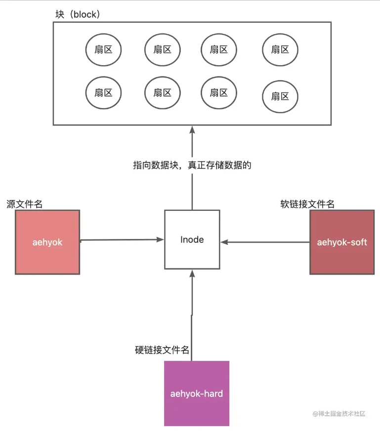

# 软链接和硬链接

简介： 硬链接（hard link）对一个文件进行修改，可能会影响到其他文件的内容，但是删除一个文件名，并不会影响其他文件名的访问。

## 一、硬链接与软链接的定义

**硬链接（hard link）：** 对一个文件进行修改，可能会影响到其他硬链接的文件的内容，但是删除一个文件名，并不会影响其他文件名的访问。

**软链接：** 可以说成是符号连接，它有点类似于 Windows 的快捷方式，实际上它是一个特殊的文件。在符号连接中，文件实际上是一个文本文件，其中包含的有另一文件的位置信息。

## 二、硬链接

#### 1、创建原始文件

我们创建一个文件`hard`, 并将`"hello kangkang，this file for hard-link"`写入文件

```shell
# 创建一个文件，并写入字符串
$ touch hard

# 列出文件列表
$ ll
total 0
-rw-r--r-- 1 53563 197609 0 Jan 20 20:21 hard

# 对文件写入内容
$ echo '"hello kangkang，this file for hard-link"' > hard

# 打印文件内容
$ cat hard
"hello kangkang，this file for hard-link"
```

#### 2、创建硬链接文件

我们创建一个文件`hard-1`，并查看内容

```bash
# 新增硬链接文件hard-1
$ ln hard hard-1

# 打印hard-1文件，查看内容
$ cat hard-1
"hello kangkang，this file for hard-link"

# 查看当前文件列表
$ ls -li
total 2
1125899906921561 -rw-r--r-- 2 53563 197609 43 Jan 20 20:31 hard
1125899906921561 -rw-r--r-- 2 53563 197609 43 Jan 20 20:31 hard-1
```

我们可以看到，两个文件除了名字不一样，其他都是一样的。

#### 3、修改硬链接文件内容,并作比对

我们将`"test hard-link"`写入`hard-1`，打印两个文件，查看一下内容

```powershell
# 将"test hard-link"写入hard-1
$ echo '"test hard-link"' >>hard-1

# 打印hard-1文件，查看内容
$ cat hard-1
"hello kangkang，this file for hard-link"
"test hard-link"

# 打印hard文件，查看内容
$ cat hard
"hello kangkang，this file for hard-link"
"test hard-link"
```

#### 4、我们尝试再新增一个硬链接文件

我们尝试新增一个 `hard-2` 文件，并将 `"test hard-link 2"` 写入，打印并对比三个文件的内容。

```powershell
# 新增硬链接文件hard-1
$ ln hard hard-2

# 打印hard-2文件，查看内容
$ cat hard-2
"hello kangkang，this file for hard-link"
"test hard-link"

# 将"test hard-link 2"写入hard-2
$ echo '"test hard-link 2"' >>hard-2

# 查看当前文件列表
$ ll
total 3
-rw-r--r-- 4 53563 197609 79 Jan 20 20:43 hard
-rw-r--r-- 4 53563 197609 79 Jan 20 20:43 hard-1
-rw-r--r-- 4 53563 197609 79 Jan 20 20:43 hard-2

# 打印hard-2文件，查看内容
$ cat hard-2
"hello kangkang，this file for hard-link"
"test hard-link"
"test hard-link 2"

# 打印hard文件，查看内容
$ cat hard
"hello kangkang，this file for hard-link"
"test hard-link"
"test hard-link 2"

# 打印hard-1文件，查看内容
$ cat hard-1
"hello kangkang，this file for hard-link"
"test hard-link"
"test hard-link 2"
```

#### 5、删除硬链接文件

我们尝试删掉`hard-2`文件，查看`hard`和`hard-1`文件发现内容没有变化

```powershell
# 删除hard-2文件
$ rm hard-2

# 列出当前文件列表
$ ll
total 2
-rw-r--r-- 3 53563 197609 79 Jan 20 20:43 hard
-rw-r--r-- 3 53563 197609 79 Jan 20 20:43 hard-1

# 打印hard文件，查看内容有无变化
$ cat hard
"hello kangkang，this file for hard-link"
"test hard-link"
"test hard-link 2"

# 打印hard-1文件，查看内容有无变化
$ cat hard-1
"hello kangkang，this file for hard-link"
"test hard-link"
"test hard-link 2"
```

我们再尝试删掉原始的 `hard` 文件、发现仅剩的 `hard-1` 内容依然没变化

```powershell
# 删除hard
$ rm hard

# 打印hard-1文件，查看内容有无变化
$ cat hard-1
"hello kangkang，this file for hard-link"
"test hard-link"
"test hard-link 2"

# 列出当前文件列表
$ ll
total 1
-rw-r--r-- 2 53563 197609 79 Jan 20 20:43 hard-1
```

#### 6、查看文件信息

```powershell
$ stat hard
  File: hard
  Size: 79              Blocks: 1          IO Block: 65536  regular file
Device: fc4828abh/4232587435d   Inode: 3377699720606788  Links: 3
Access: (0644/-rw-r--r--)  Uid: (197609/   53563)   Gid: (197609/ UNKNOWN)
Access: 2025-01-21 00:00:51.028502200 +0800
Modify: 2025-01-21 00:00:44.444642800 +0800
Change: 2025-01-21 00:00:44.444642800 +0800
 Birth: 2025-01-20 23:59:32.807521200 +0800
```

## 三、软链接

#### 1、创建原始文件

我们创建一个文件`source.txt`, 并将`"hello kangkang，this file for soft-link"`写入文件

```shell
# 创建一个文件，并写入字符串
$ touch source.txt

# 对文件写入内容
$ echo '"hello kangkang，this file for soft-link"' > source.txt

# 打印文件内容
$ cat source.txt
"hello kangkang，this file for soft-link"
```

#### 2、创建软链接文件

我们创建一个文件`soft-1`，并查看内容

```shell
# 新增硬链接文件soft和soft2
$ ln -s source.txt source-soft.txt
$ ln -s source.txt source-soft2.txt
$ ln source.txt source-hard.txt
$ ln source.txt source-hard2.txt

# 打印source-soft2.txt文件，查看内容
$ cat source-soft2.txt
"hello kangkang，this file for soft-link"

# 查看当前文件列表
$ ls -li
total 5
1125899906921625 -rw-r--r-- 3 53563 197609 54  1月 21 00:40 source.txt
1125899906921625 -rw-r--r-- 3 53563 197609 54  1月 21 00:40 source-hard.txt
1125899906921625 -rw-r--r-- 3 53563 197609 54  1月 21 00:40 source-hard2.txt
1125899906921626 -rw-r--r-- 1 53563 197609 54  1月 21 00:40 source-soft.txt -> source.txt
1125899906921628 -rw-r--r-- 1 53563 197609 54  1月 21 00:40 source-soft2.txt -> source.txt
```

我们可以看到，软连接的`inode`、`文件名`、`连接数`都是好源文件不一样的

#### 3、删除软链接文件

```shell
# 删除source.txt
$ rm source.txt

# 打印hard文件，查看内容
$ cat source-hard.txt
"hello kangkang，this file for soft-link"

# 打印source-soft2.txt文件，查看内容
$ cat source-soft2.txt
cat: source-soft2.txt: No such file or directory
```

删除原文件之后，硬链接文件可以正常访问，但是访问软链接文件报错了。这里与我们开头总结的定义正好吻合了。

#### 4、写入数据到软链接

```shell
echo "delete hello world" >> source-soft2.txt
cat source-soft2.txt
cat source.txt
ls -li
```

可以发现，写入软链接数据之后，原文件竟然出现了，但是里面的数据块 inode 是新的了，因为软链接文件中保存的是有引用原文件路径的，但是原文件已经不存在了。现在相当于根据路径重新生成并写入原文件。

## 四、总结



- 硬链接不会创建额外 `inode`，它和源文件共用同一个 `inode`

- 软链接会创建新的文件和 `inode`，但是软链接文件 `inode` 指向源文件的 `inode`

- 建立硬链接时，源必须存在且只能是文件

- 建立软链接时，源可以不存在而且可以是目录

- 删除源文件不会影响硬链接文件的访问（因为 `inode` 还在）

- 删除源文件会影响软链接文件的访问（因为指向的 `inode` 已经不存在了）
