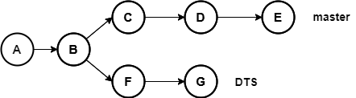
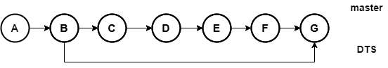
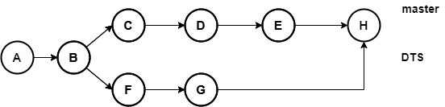
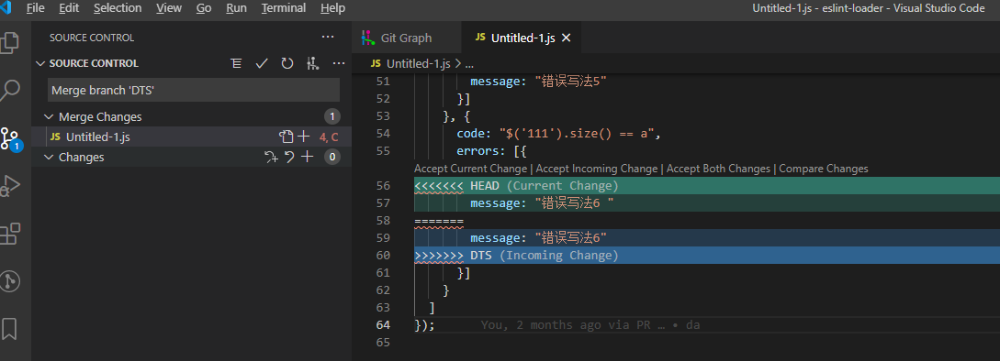

# git merge

::: tip 主要作用
操作分支，对分支进行merge操作
:::

## 语法

```bash
git merge [-n] [--stat] [--no-commit] [--squash] [--[no-]edit]
        [--no-verify] [-s <strategy>] [-X <strategy-option>] [-S[<keyid>]]
        [--[no-]allow-unrelated-histories]
        [--[no-]rerere-autoupdate] [-m <msg>] [-F <file>] [<commit>…​]
git merge (--continue | --abort | --quit)
```

## 常用的参数

| 参数         | 解释                   |
|:---------- |:-------------------- |
| --squash   | 将某个分支所有的提交捏成一个提交合并过来 |
| --no-ff    | 强制以合并提交形式结束          |
| --continue | 处理完冲突继续合并            |
| --abort    | 中断合并，放弃当前处理          |
| --quit     | 跳过当前冲突，继续合并          |
| -m \<msg\> | 指定合并提交的信息            |

## 常用命令举例：

- 将DTS分支合并到当前分支
  
  ```bash
  git merge DTS
  ```

- 将DTS分支捏成一个提交合并到当前分支
  
  ```bash
  git merge DTS --squash
  ```

## 详细介绍

假设当前有以下`DTS`和`master`分支



将`DTS`分支合并到`master`分支

```bash
git merge DTS
```

那么他的合并结果有以下两种：

- 没有遇到冲突，结果类似于rebase或者快进



- 遇到冲突，冲突的处理结果，会生成一个合并提交



::: warning 提示
第一种没有遇到冲突的合并场景，可以使用`--no-ff`参数强制以合并提交形式结束
:::

## 冲突的处理

一般发生冲突都会有类似以下信息：

```bash
PS D:\code\eslint-loader> git merge DTS
Auto-merging Untitled-1.js
CONFLICT (content): Merge conflict in Untitled-1.js
Automatic merge failed; fix conflicts and then commit the result.
```



编辑完冲突内容后，将冲突文件添加到暂存区

```bash
git add .
```

然后继续进行merge，或者进行commit提交 ，两种处理方式都可

```bash
git merge --continue
## 或
git commit -m "merge原因"
```

::: warning 说明

- 和rebase不同的是，分支merge过程中产生的所有冲突，在合并完成后，最后一次性处理。
- 而rebase是把提交一个一个的合并，如果一个提交遇到冲突，需要处理完当前提交冲突，才能继续进行下个提交的处理。
- merge不会改变提交内容，而rebase会，这是本质区别。
  :::
