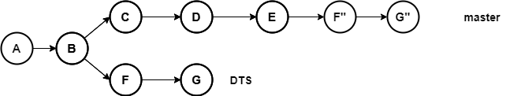

# git rebase

::: tip 主要作用
操作分支，变基，会改变提交历史
:::

## 语法

```bash
git rebase [<options>] [<commit>] [--] [<path>…​]
git rebase [<options>] --cached [<commit>] [--] [<path>…​]
git rebase [<options>] <commit> [<commit>…​] <commit> [--] [<path>…​]
git rebase [<options>] <commit>…​<commit> [--] [<path>…​]
git rebase [<options>] <blob> <blob>
git rebase [<options>] --no-index [--] <path> <path>
```

## 常用的参数

| 参数               | 解释                 |
|:---------------- |:------------------ |
| --continue       | 处理完冲突，继续变基         |
| --abort          | 中断当前处理，放弃变基        |
| -i,--interactive | 交互式变基，操作commit，增删改 |

## 常用命令举例：

- 将DTS分支变基到当前分支
  
  ```bash
  git rebase DTS
  ```

- 交互式变基处理当前提交历史
  
  ```bash
  git rebase -i head~11
  ```

## 详细介绍

假设当前有以下`DTS`和`master`分支


将`DTS`分支合并到`master`分支

```bash
git rebase DTS
```

那么他的合并结果：



::: warning 提示
rebase变基过来的分支，其实和原分支的提交已经不再一致。  
如果没有遇到冲突，仅仅只是提交的hash值（commit-id）变了
如果遇到冲突，则冲突的提交内容也会发生改变
:::

## 冲突的处理

冲突处理都是一致的，可以参考merge一节

处理完冲突以后，添加到暂存区

```bash
git add .
```

继续变基

```bash
git rebase --continue
```
