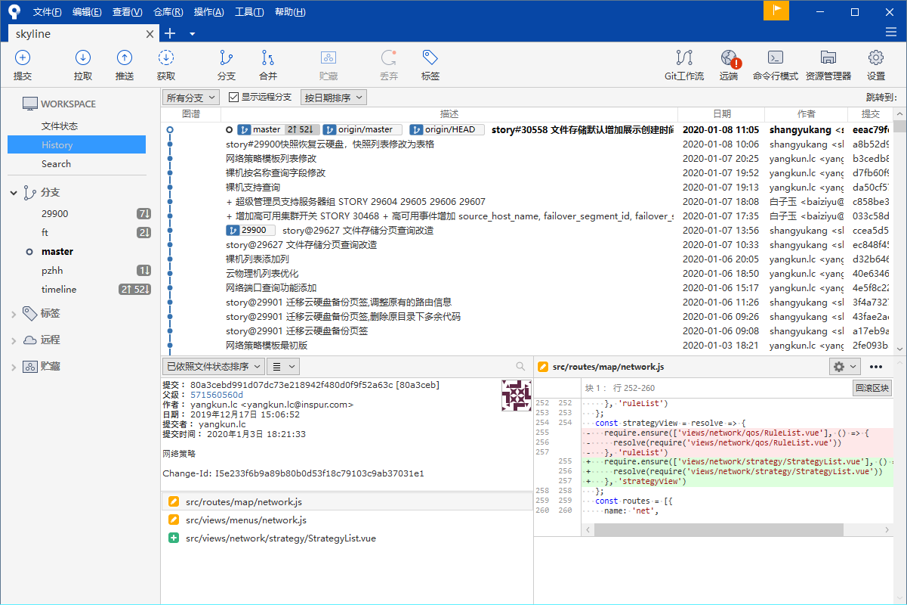
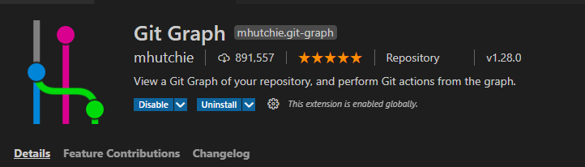
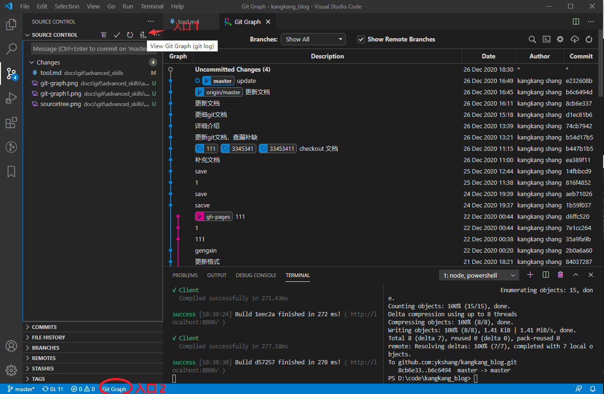
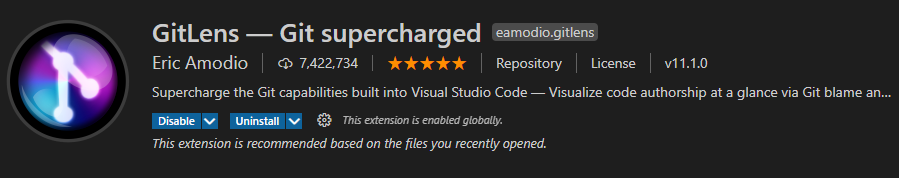
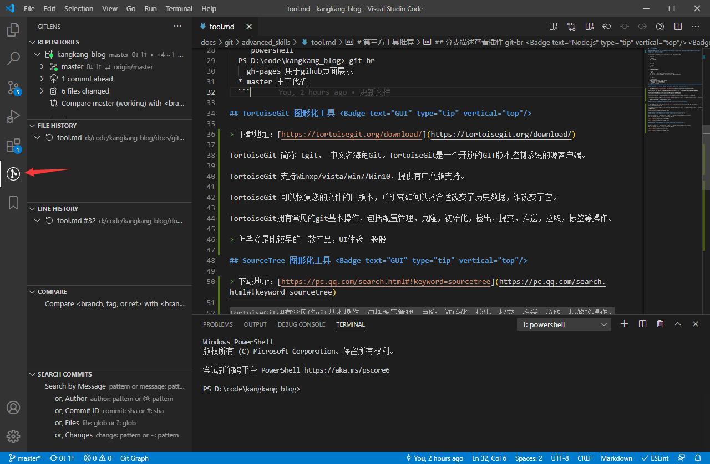

# 第三方工具推荐

## git-br 分支描述查看插件 <Badge text="Node.js" type="tip" vertical="top"/><Badge text="npm" type="tip" vertical="top"/>

主要用来查看分支的描述，其中描述主要是用来标记分支的作用。

- 安装插件
  
  ```bash
  npm i git-br
  ```

- 使用插件
  
  ```bash
  git br
  ```

- 配置分支描述数据
  
  ```bash
  git config branch.master.description 主干代码
  git config branch.gh-pages.description 用于gihub页面展示
  ```

- 执行效果
  
  ```powershell
  PS D:\code\kangkang_blog> git br
    gh-pages 用于gihub页面展示
  * master 主干代码
  ```

## TortoiseGit 图形化工具 <Badge text="GUI" type="tip" vertical="top"/>

> 下载地址：[https://tortoisegit.org/download/](https://tortoisegit.org/download/)

TortoiseGit 简称 tgit， 中文名海龟Git。TortoiseGit是一个开放的GIT版本控制系统的源客户端。

TortoiseGit 支持Winxp/vista/win7/Win10，提供有中文版支持。

TortoiseGit 可以恢复您的文件的旧版本，并研究如何以及合适改变了历史数据，谁改变了它。

TortoiseGit拥有常见的git基本操作，包括配置管理，克隆，初始化，检出，提交，推送，拉取，标签等操作。

> 但毕竟是比较早的一款产品，UI体验一般般

## SourceTree 图形化工具 <Badge text="GUI" type="tip" vertical="top"/>

> 下载地址：[https://pc.qq.com/search.html#!keyword=sourcetree](https://pc.qq.com/search.html#!keyword=sourcetree)

TortoiseGit拥有常见的git基本操作，包括配置管理，克隆，初始化，检出，提交，推送，拉取，标签等操作。
界面比较美观



## Git Graph 插件 <Badge text="VsCode" type="tip" vertical="top"/>

如果使用VsCode作为开发IDE的话Git Graph是一款不错的插件。嵌入到IDE使用比较方便
具备常见的管理配置，检出，查看历史等诸多功能。





## Gitlents 插件 <Badge text="VsCode" type="tip" vertical="top"/>

如果使用VsCode作为开发IDE的话Gitlents是一款不错的插件。嵌入到IDE使用比较方便

最优秀的点在于行历史功能




