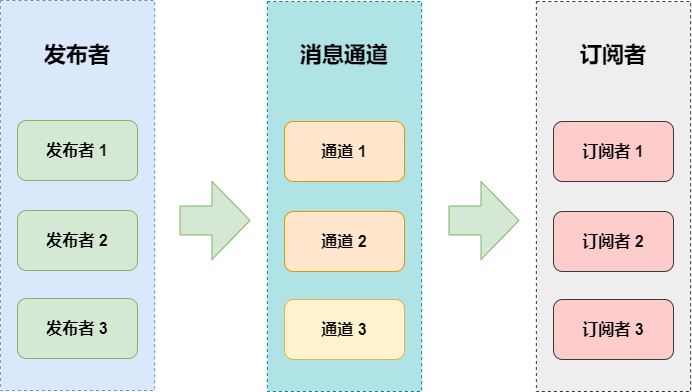
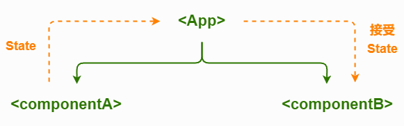

# 1、发布/订阅模式

## 一、什么是发布订阅模式

发布订阅模式是一种消息范式，涉及消息的发送者（称为**发布者**）和接收者（称为**订阅者**）。在这种模式中，发布者和订阅者不直接相互了解，而是通过一个称为"**事件通道**"或"消息代理"的中间人来管理消息的分发。

这种模式提供了更好的程序解耦，增强了程序的可扩展性和可维护性。它是一种对象间一对多的依赖关系，当一个对象的状态发生改变时，所有依赖于它的对象都将得到通知。

**现实生活中的例子：**

- 报纸订阅：读者（订阅者）订阅报纸，出版社（发布者）通过邮局（事件通道）发送报纸。
- 电子邮件列表：用户订阅感兴趣的主题，当有新内容时，系统自动发送邮件给所有订阅者。
- 社交媒体：用户关注某个主题或人物，平台在有更新时推送通知。
- 股票市场：投资者订阅特定股票的价格变动，当价格变化时，系统通知所有订阅该股票的投资者。

在 JavaScript 中，发布订阅模式常用于处理异步操作和事件驱动编程，特别是在前端开发中。它是实现松耦合、可扩展系统的重要工具。

## 二、核心概念

发布订阅模式主要包含三个核心角色：

- 发布者（Publisher）：负责创建消息，但不直接发送给订阅者。
- 订阅者（Subscriber）：对特定消息感兴趣的对象，只接收感兴趣的消息。
- 消息通道（Message Channel）：连接发布者和订阅者的中介，管理订阅关系并分发消息。

除了这三个核心角色，还有一些重要的概念：

- 主题（Topic）：消息的分类或频道，订阅者可以订阅特定的主题。
- 消息（Message）：从发布者传递到订阅者的信息载体。
- 回调函数（Callback）：订阅者提供的函数，在接收到消息时被调用。

## 三、工作流程

1. **建立订阅关系：** **订阅者** 通过 **特定的消息通道** 向 **发布者** 订阅请求，来接收相关消息

2. **发布者发布消息：** 发布者向消息通道推送消息。

3. **消息通道派发消息：** 消息通道将消息分发给所有相关的订阅者。

4. **订阅者接收处理：** 订阅者接收并处理消息。



## 四、代码示例

#### 1、代码

让我们用 JavaScript 实现一个简单但功能完整的发布订阅系统：

```js
// 封装发布者原型
class Publisher {
  constructor(positon, name) {
    // 维护事件 和 订阅关系
    this.subscribers = {}; // { eventType: [john, kangkang, ...] }
    // 发布者的职位
    this.positon = positon;
    // 发布者的名字
    this.name = name;
  }

  // 负责添加新的订阅关系
  subscribe(eventType, receiver) {
    // 1. 如果事件不存在，创建新事件
    if (!this.subscribers[eventType]) {
      this.subscribers[eventType] = [];
    }
    // 2. 将订阅者关联到该事件上去
    this.subscribers[eventType].push(receiver);
    console.log(
      `【添加订阅】${this.positon} ${this.name} 接受了读者 ${receiver.name} 的订阅请求，成功！`
    );
  }

  // 负责删除订阅关系，将订阅者从该事件上移除
  unsubscribe(eventType, receiver) {
    if (this.subscribers[eventType]) {
      this.subscribers[eventType] = this.subscribers[eventType].filter(
        (user) => user !== receiver
      );
    }
    console.log(
      `【取消订阅】读者 ${receiver.name} 向 ${this.positon} ${this.name} 请求取消订阅，成功！`
    );
  }
  // 事件发布机制，如果指定事件存在，发布消息发给所有该事件的订阅者
  publish(eventType, message) {
    if (this.subscribers[eventType] && subscribeAction[eventType]) {
      this.subscribers[eventType].forEach((receiver) => {
        // 假定所有的订阅者 处理消息的方式是相同的。
        subscribeAction[eventType](receiver, this.positon, this.name, message);
      });
    }
  }
}

// 维护 事件 和 处理方式 的映射
let subscribeAction = {
  notify: function (receiver, positon, publisher, message) {
    console.log(
      `【新通知】读者 ${receiver.name} 收到来自 ${positon} ${publisher} 的通知: ${message}`
    );
  },
};
// 订阅者原型
class Receiver {
  constructor(name) {
    this.name = name;
  }
}

// -------新增发布者 -------
const xiaoWang = new Publisher("送报员", "小王"); // 发布者 送报员 小王
const xiaoLi = new Publisher("图书管理员", "小李"); // 发布者 图书管理员 小李

// -------新增订阅者 -------
const john = new Receiver("john"); // 读者 john
const kangkang = new Receiver("kangkang"); // 读者 kangkang

// -------添加订阅关系 -------
// 使用"notify" 作为消息通道名称 用来描述用户 订阅图书和报纸的行为
xiaoWang.subscribe("notify", john); // 送报员小王 接受了 john 报纸订阅请求
xiaoWang.subscribe("notify", kangkang); // 送报员小王 接受了 kangkang 报纸订阅请求
xiaoLi.subscribe("notify", john); // 图书管理员小李 接受了 john 图书订阅请求
xiaoLi.subscribe("notify", kangkang); // 图书管理员小李 接受了 kangkang 图书订阅请求
console.log("-------------------");

// -------发布事件 -------
// 小王通知所有人，新报纸到了
xiaoWang.publish("notify", "'Hello, 这是今天的报纸！'");
// 小李通知所有人，新图书到了
xiaoLi.publish("notify", "'Hello, 这是您定的杂志！'");
console.log("-------------------");

// -------取消订阅 -------
// john 向小王请求取消了报纸订阅
xiaoWang.unsubscribe("notify", john);
```

#### 2、输出结果

```shell
【添加订阅】送报员 小王 接受了读者 john 的订阅请求，成功！
【添加订阅】送报员 小王 接受了读者 kangkang 的订阅请求，成功！
【添加订阅】图书管理员 小李 接受了读者 john 的订阅请求，成功！
【添加订阅】图书管理员 小李 接受了读者 kangkang 的订阅请求，成功！
-------------------
【新通知】读者 john 收到来自 送报员 小王 的通知: 'Hello, 这是今天的报纸！'
【新通知】读者 kangkang 收到来自 送报员 小王 的通知: 'Hello, 这是今天的报纸！'
【新通知】读者 john 收到来自 图书管理员 小李 的通知: 'Hello, 这是您定的杂志！'
【新通知】读者 kangkang 收到来自 图书管理员 小李 的通知: 'Hello, 这是您定的杂志！'
-------------------
【取消订阅】读者 john 向 送报员 小王 请求取消订阅，成功！
```

这个实现包含了发布订阅模式的核心功能：订阅、发布、取消订阅，以及只订阅一次的功能。它使用了 ES6 的类语法，使代码更加清晰和易于理解。

## 五、优缺点

**优点**

- **松耦合**：发布者和订阅者之间没有直接依赖，提高了系统的调用程度。
- **可扩展性**：可以轻松添加新的订阅者而不影响现有系统，符合开闭原则。
- **灵活性**：订阅者可以动态地订阅或取消订阅，适应变化的需求。
- **异步通信**：支持系统组件之间的异步通信，提高了系统的响应性。
- **一对多通信**：一个发布者可以同时通知多个订阅者，方便实现广播功能。

**缺点**

- **维护复杂性**：在大型系统中，可能难以跟踪和维护所有的订阅关系，增加了调试的难度。
- **性能上限**：间隙地发布和订阅可能导致性能问题，特别是在高并发情况下。
- **补充**：如果消息没有正确送达，可能导致系统状态不一致，需要额外的机制来确保消息的可靠发送。
- **调试困难**：事件流程可能变得复杂，导致系统行为难以预测和调试。
- **存储头部**：需要存储订阅者的回调函数，可能占用分区内存。

## 六、应用场景

发布订阅模式在前端开发中有广泛的应用，例如：

#### 1、用户界面更新：

当数据模型发生变化时，自动更新相关的 UI 组件。

```js
// 数据模型
const dataModel = {
  data: [],
  eventEmitter: new EventEmitter(),
  updateData(newData) {
    this.data = newData;
    this.eventEmitter.publish("dataUpdated", this.data);
  },
};

// UI组件
function UIComponent() {
  dataModel.eventEmitter.subscribe("dataUpdated", (data) => {
    // 更新UI
    console.log("Updating UI with:", data);
  });
}
dataModel.updateData(xxxx);
```

#### 2、跨组件通信：

在复杂的单页应用中，实现不同组件之间的解耦通信。



#### 3、异步操作管理：

```js
const apiClient = {
  eventEmitter: new EventEmitter(),
  fetchData() {
    fetch("/api/data")
      .then((response) => response.json())
      .then((data) => {
        this.eventEmitter.publish("dataFetched", data);
      });
  },
};

apiClient.eventEmitter.subscribe("dataFetched", (data) => {
  console.log("Data received:", data);
});

apiClient.fetchData();
```

#### 4、插件系统：

允许第三方开发者通过订阅特定事件来扩展应用功能。

#### 5、状态管理：

在大型应用中管理和同步应用状态。

#### 6、实时应用：

在聊天应用或协作工具中，当接收到新消息时通知相关组件。

## 七、实际应用中的注意事项

1. 内存管理：确保在组件个别时取消订阅，避免内存泄漏。

```js
class Component {
  constructor(eventEmitter) {
    this.eventEmitter = eventEmitter;
    this.handleEvent = this.handleEvent.bind(this);
    this.eventEmitter.subscribe("someEvent", this.handleEvent);
  }

  handleEvent(data) {
    console.log("Event handled:", data);
  }

  destroy() {
    this.eventEmitter.unsubscribe("someEvent", this.handleEvent);
  }
}
```

2. 错误处理：在事件处理器中加入适当的错误机制处理。

```js
eventEmitter.subscribe("importantEvent", (data) => {
  try {
    // 处理事件
    processData(data);
  } catch (error) {
    console.error("Error handling event:", error);
    // 可能的错误恢复机制
    errorRecovery();
  }
});
```

3. 命名约定：使用清晰一致的事件命名约定，避免命名冲突。

```js
const EVENT_TYPES = {
  USER_LOGIN: "user:login",
  USER_LOGOUT: "user:logout",
  DATA_UPDATED: "data:updated",
};

eventEmitter.subscribe(EVENT_TYPES.USER_LOGIN, handleUserLogin);
```

4. 类型安全：在 TypeScript 项目中，可以利用类型系统来增强发布订阅模式的安全性。

```js
type EventMap = {
  'userLoggedIn': { userId: string };
  'dataLoaded': { items: any[] };
};

class TypedEventEmitter {
  private events: { [K in keyof EventMap]?: ((data: EventMap[K]) => void)[] } = {};

  subscribe<K extends keyof EventMap>(event: K, callback: (data: EventMap[K]) => void) {
    if (!this.events[event]) {
      this.events[event] = [];
    }
    this.events[event]!.push(callback);
    return () => this.unsubscribe(event, callback);
  }

  publish<K extends keyof EventMap>(event: K, data: EventMap[K]) {
    if (this.events[event]) {
      this.events[event]!.forEach(callback => callback(data));
    }
  }

  private unsubscribe<K extends keyof EventMap>(event: K, callback: (data: EventMap[K]) => void) {
    this.events[event] = this.events[event]?.filter(cb => cb !== callback);
  }
}

```

5. 避免过度使用：虽然发布订阅模式很强大，但过度使用可能导致代码难以理解和维护。在适当的场景下使用。

6. 文档化：确保所有的事件及其用途都有良好的文档记录，这对于大型项目的维护至关重要。

```js
/**
 1. @event userLoggedIn
2. @type {Object}
3. @property {string} userId - The ID of the logged-in user
4. @property {string} username - The username of the logged-in user
5. @description Fired when a user successfully logs in
*/
eventEmitter.publish("userLoggedIn", { userId: "123", username: "john_doe" });
```

7. 性能优化：对于高频事件，考虑使用节流（throttle）或防抖（debounce）技术。

```js
import { debounce } from "lodash";

const debouncedPublish = debounce((eventName, data) => {
  eventEmitter.publish(eventName, data);
}, 300);

// 使用防抖后的发布方法
debouncedPublish("frequentEvent", { someData: "value" });
```

8. 事件优先级：在复杂系统中，考虑实际事件优先级机制，确保重要事件得到及时处理。

```js
class PriorityEventEmitter extends EventEmitter {
  publishWithPriority(eventName, data, priority = 0) {
    const callbacks = this.events[eventName];
    if (callbacks) {
      callbacks.sort((a, b) => b.priority - a.priority);
      callbacks.forEach((cb) => cb.callback(data));
    }
  }

  subscribeWithPriority(eventName, callback, priority = 0) {
    if (!this.events[eventName]) {
      this.events[eventName] = [];
    }
    this.events[eventName].push({ callback, priority });
    return () => this.unsubscribe(eventName, callback);
  }
}
```
