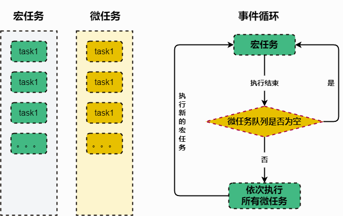

# 9、事件循环

## 什么是事件循环

**事件循环是 JavaScript 运行时环境中用来处理异步事件的机制**。它是实现 JavaScript 的单线程执行模型的核心部分。

**Web 浏览器环境中**：事件循环负责处理**用户交互事件（如点击、滚动等）**、**网络请求**、**计时器**、**定时器**、**其他异步操作（Promise 等）** 等。

**Node.js 环境中**：事件循环负责处理**I/O 操作**、**网络请求** 等异步任务。

事件循环的执行过程是**一个不断重复的循环**。每次循环被称为一个"**tick**"。在每个 tick 中，**事件循环会首先检查是否有待处理的异步事件**。

如果有，它们会被添加到 **事件队列** 中。然后，事件循环会从事件队列中取出一个事件，并且执行对应的回调函数。执行完毕后，如果事件队列中还有待处理的事件，继续取出并执行。**这个过程不断重复，直到事件队列为空**。

**这个执行模型保证了 JavaScript 代码的单线程执行，避免了多线程编程带来的竞态条件和资源共享问题**。同时，通过异步事件和回调函数的机制，JavaScript 可以处理非阻塞的 I/O 操作和其他异步任务。

理解事件循环对于编写高效和可靠的异步 JavaScript 代码非常重要。它提供了一个清晰的执行模型，帮助开发者理解异步代码的执行顺序和行为。

::: tip 事件循环详解

1. 在执行栈中执行一个宏任务。
2. 执行过程中遇到微任务，将微任务添加到微任务队列中。
3. 当前宏任务执行完毕，立即执行微任务队列中的任务。
4. 当前微任务队列中的任务执行完毕，检查渲染，GUI 线程接管渲染。
5. 渲染完毕后，js 线程接管，执行下一次宏任务（事件队列中取）。

至此完成一次事件循环、**执行下一次宏任务就意味着下一次循环的开启。**
:::

**事件循环图解**



## 宏任务和微任务

#### 宏任务

1. **用户交互事件**：例如点击、滚动、输入等用户操作触发的事件。
2. **setTimeout** 和 **setInterval**：通过定时器触发的任务。
3. **网络请求完成事件**：例如 Ajax 请求完成时触发的事件。
4. **文件读写操作**：包括读取文件、写入文件等涉及到 I/O 操作的任务。
5. **页面解析和渲染**：包括 DOM 解析、CSS 解析、页面布局和绘制等与页面渲染相关的任务。
6. **requestAnimationFrame**：用于执行动画效果的任务。

#### 微任务

1. **Promise 回调函数**：Promise 对象的处理程序（.then、.catch、.finally）中的回调函数都是微任务。
2. **MutationObserver**：用于监测 DOM 变化的任务。
3. **process.nextTick（在 Node.js 环境下）**：在当前执行栈结束后立即执行的任务。
4. **queueMicrotask()**：用于将一个微任务添加到微任务队列中。

### 二者区别

#### 宏任务

1. 宏任务所处的队列就是**宏任务队列**

2. 宏任务队列可以有多个

3. 当宏任务队列的中的任务全部执行完以后会查看是否有微任务队列如果有先执行微任务队列中的所有任务，如果没有就查看是否有宏任务队列

#### 微任务

1. 微任务所处的队列就是**微任务队列**

2. 只有一个微任务队列

3. 在上一个宏任务队列执行完毕后如果有微任务队列就会执行微任务队列中的所有任务

#### 总结

首先浏览器执行 js 进入主线程, 然后再判断是否有微任务，有就执行；

再判断是否有宏任务，有进行执行，执行后，再判断是否有微任务，循环此操作。这个循环的过程**又称为 EventLoop**.

例子

```js
//主线程开始执行
console.log("1");
setTimeout(function () {
  console.log("2");
  process.nextTick(function () {
    console.log("3");
  });
});
new Promise(function (resolve) {
  console.log("4");
  resolve();
}).then(function () {
  console.log("5");
});

process.nextTick(function () {
  console.log("6");
});

new Promise(function (resolve) {
  console.log("7");
  resolve();
}).then(function () {
  console.log("8");
});

//丢到宏事件队列中
setTimeout(function () {
  console.log("9");
  process.nextTick(function () {
    console.log("10");
  });
  new Promise(function (resolve) {
    console.log("11");
    resolve();
  }).then(function () {
    console.log("12");
  });
});

console.log("13");
// 执行输出结果：1 4 7 13 6 5 8 2 3 9 11 10 12
```
