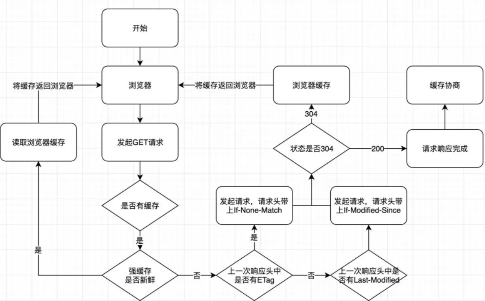

# Http 缓存、Web 缓存

## Http 缓存

缓存是在计算机中**临时存储数据以提高访问速度**的技术。在 Web 开发中，HTTP 缓存用于存储在 Web 浏览器和 Web 服务器之间传输的资源副本，以便在下次请求相同资源时可以直接从缓存中获取，而不必再次从服务器请求。

### HTTP 缓存分类如下：

1. **私有缓存**：私有缓存是由特定用户或浏览器进行管理的缓存。它仅对创建缓存的用户可见，不会与其他用户共享。私有缓存可以存储用户特定的数据，如浏览器历史记录、Cookie 等。

2. **共享缓存**：共享缓存是由多个用户或浏览器共享的缓存。这样的缓存通常位于用户终端和网络之间的代理服务器上，可以被多个用户重复使用。共享缓存可以减少网络流量和减轻服务器负载。

### HTTP 缓存的机制主要包括以下几个方面：

1. **缓存验证**：在请求资源时，浏览器发送包含验证信息的请求头，服务器使用该信息来验证是否可以使用缓存。如果资源没有被修改，则服务器返回一个特殊的响应状态码来指示浏览器使用缓存。
2. **缓存过期**：服务器可以在响应头中设置一个过期时间或者最大的缓存时间，浏览器会将此信息保存在缓存中，并在下次请求时使用该信息判断是否过期。如果资源过期，则浏览器会向服务器发送请求获取最新版本的资源。
3. **缓存协商**：当缓存的资源过期或者未设置过期时间时，浏览器会向服务器发送一次条件请求，询问服务器缓存的资源是否可用。服务器可以通过比较请求头中的条件信息（如`ETag`或`Last-Modified`）与资源的当前状态来判断是否需要返回新的资源，或者返回一个特殊的响应状态码来指示浏览器使用缓存。

通过使用 HTTP 缓存，可以减少对服务器的请求，节省带宽和提高网页加载速度，提升用户体验。同时，合理配置缓存策略可以避免一些常见的缓存相关问题，如缓存过期、缓存不一致等。

## 浏览器（Web）缓存

Web 缓存是一种用于临时存储网页资源的机制，它可以提高网页加载速度和减少网络流量。浏览器会在本地存储已访问过的资源（例如 HTML、CSS、JavaScript、图像等），当再次访问相同资源时，浏览器会尝试从缓存中获取资源，而不是重新下载。

**缓存流程：**

### 浏览器缓存的工作原理如下：

1. 当浏览器首次请求某个资源时，服务器会在响应中附带缓存相关的 HTTP 头信息，例如`"Cache-Control"`和`"Expires"`。

2. 浏览器会将这些资源以键值对的形式保存在本地缓存中，键是资源的 URL，值是具体的资源内容。

3. 下次请求相同资源时，浏览器会检查缓存中是否有匹配的资源。
   1. 如果缓存中存在匹配的资源，并且缓存未过期（根据"Cache-Control"和"Expires"头信息判断），则浏览器直接从缓存中获取资源。
   2. 如果缓存中存在匹配的资源，但缓存已过期，则浏览器发送带有`"Cache-Control"`和`"Expires"`头信息的条件请求，即发送一个`"If-None-Match"`和/或一个`"If-Modified-Since"`头信息给服务器，用于验证资源是否有更新。如果服务器返回 `304` 状态码表示资源未更新，则浏览器从缓存中获取资源；否则，服务器会返回新的资源。
   3. 如果缓存中不存在匹配的资源，则浏览器会发送完整的请求给服务器，并将获取到的资源保存到缓存中。

### 浏览器缓存的优化策略包括：

1. **利用缓存通知头信息**：使用正确的缓存头信息（例如`"Cache-Control"`、`"Expires"`、`"ETag"`等）确保资源可以被正确缓存和更新。
2. **实施版本控制**：将资源的 URL 与其版本关联起来，当资源发生变化时，更新 URL，以避免缓存旧版本的资源。
3. **使用指纹或哈希**：通过向资源的 URL 添加`指纹`或`哈希值`，可以确保资源的唯一性，从而避免缓存资源冲突。
4. **控制缓存时间**：通过设置正确的`"Cache-Control"`和`"Expires"`头信息，可以控制资源在缓存中的保留时间。
5. **大小和数量的限制**：设置适当的缓存大小和数量限制，避免过多的缓存导致性能下降。
6. **永久缓存不变的资源**：对于一些静态资源（例如 logo、图标等），可以通过设置较长的缓存时间或使用永久缓存策略（例如使用"immutable"指令）来避免发送条件请求验证资源更新。

以上是浏览器缓存的工作原理和一些优化策略的简要描述，它们可以帮助提高网页加载速度和减少网络流量。
