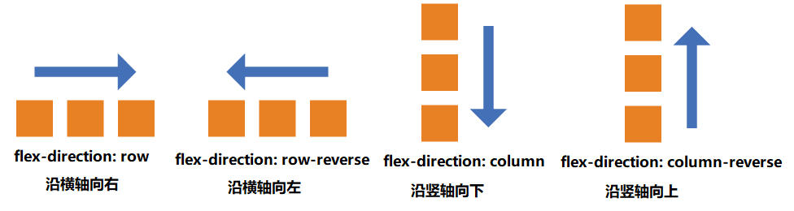

# 弹性容器

## 1、flex-direction

设置主轴方向和默认的元素排列方向（即起始线和终止线的位置）

### 1.1 可选值

```css
flex-direction: row || row-reverse || column || column-reverse;
```

- row（默认值）：主轴为水平方向，起点在左端。
- row-reverse：主轴为水平方向，起点在右端。
- column：主轴为垂直方向，起点在上沿。
- column-reverse：主轴为垂直方向，起点在下沿。

### 1.2 示意图



## 2、flex-wrap

是否允许换行

### 2.1 可选值

```css
flex-wrap: nowrap | wrap | wrap-reverse;
```

默认情况下，项目都沿着主轴方向排列。flex-wrap 属性定义，如果一条轴线排不下，如何换行。它可能有三个取值：

- nowrap（默认）：不换行，如果超宽则溢出


- wrap：超宽允许换行，由上往下，由左往右换行


- wrap-reverse：超宽允许逆序换行，由下往上，由左往右换行


## 3、justify-content

该属性定义了项目在主轴上的对齐方式。

### 3.1 可选值

```css
justify-content: flex-start | flex-end | center | space-between | space-around;
```

- flex-start（默认值）：起始线对齐（可以当作左对齐理解）
- flex-end：终止线对齐
- center： 居中
- space-between：两端对齐，项目之间的间隔都相等。
- space-around：每个弹性子元素两侧分配相等的空间。所以，子元素之间的间隔比项目与边框的间隔大一倍。
- space-evenly：在主轴上平均分配间隔，等效于所有的子元素设置 margin：auto

### 3.2 示意图


## 4、align-items

该 属性定义了项目在交叉轴上的对齐方式

### 4.1 可选值：

```css
align-items: flex-start | flex-end | center | baseline | stretch;
```

- flex-start：交叉轴的起点对齐。
- flex-end：交叉轴的终点对齐。
- center：交叉轴的中点对齐。
- baseline: 项目的第一行文字的基线对齐。
- stretch（默认值）：如果项目未设置高度或设为 auto，将占满整个容器的高度。设置了高度的元素，不生效

## 5、flex-flow

该属性是 flex-direction 属性和 flex-wrap 属性的简写形式

> 默认值为 row nowrap。

```css
flex-flow: row nowrap;
```

## 6、align-content

该属性定义了多根轴线的对齐方式。如果项目只有一根轴线，该属性不起作用。

### 6.1 可选值

```css
align-content: flex-start | flex-end | center | space-between | space-around |
  stretch;
```

- flex-start：与交叉轴的起点对齐。
- flex-end：与交叉轴的终点对齐。
- center：与交叉轴的中点对齐。
- space-between：与交叉轴两端对齐，轴线之间的间隔平均分布。
- space-around：每根轴线两侧的间隔都相等。所以，轴线之间的间隔比轴线与边框的间隔大一倍。
- stretch（默认值）：轴线占满整个交叉轴。

### 6.2 示意图


