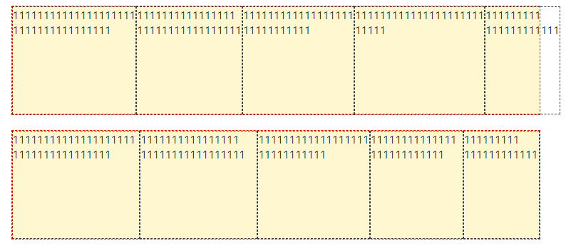

# 初始化

当一个元素被设置为 flex 容器时，那么容器内他的所有子元素具备以下行为；

- 元素排列为一行 (容器的 flex-direction 属性的初始值是 row)。
- 元素从主轴的起始线开始（容器的 justify-content，初始值为 flex-start）。
- 元素不会在主维度方向拉伸，但是可以缩小（元素的 flex-grow 默认为 0）。
- 元素被拉伸来填充交叉轴大小（容器的 align-items，默认值为 stretch）。
- flex-basis 初始值为 auto，如果元素本身上设置了主轴方向上的宽度，那么 flex-basis 的值默认取那个宽度，如果单独设置了 flex-basis，那么元素本身在主轴上的宽度不再起作用。
- flex-wrap 属性为 nowrap。

这会让你的元素呈线形排列，并且把自己的大小作为在主轴上的大小。如果有太多元素超出容器，它们会溢出而不会换行。元素会沿交叉轴被拉伸来填满它的大小。

<el-divider>一条分割线</el-divider>

## 初始化的计算过程

1. 确定弹性容器和元素

2. 根据 flex-direction 的确定容器内的主轴方向和起始线终止线的位置，flex-direction 的初始默认值为 row

3. 根据容器的 justify-content 的值，确认元素在主轴上的排列方式

4. 根据元素的 flex-grow 的值确定元素在父容器存在正向自由空间时的分配比例

5. 根据元素的 flex-shirnk 的值确定元素在父容器存在负向自由空间时的分配比例

6. 根据 flex-wrap 的值确定是否可以换行，默认值为 nowrap

   - 换行的前提是容器的空间不够分配

7. 确定 flex-basis 的值，默认值为 auto，正负自用空间的计算是根据 flex-basis 计算得到的

   - 如果元素设置了 felx-basis 的值，那么可以直接参与计算

   - 如果元素设置主轴方向上的宽度（width 或者 height，可以为像素值，可以为 max-content/contentd 等值），那么这个宽度就是 flex-basis 的值

   - 如果元素未设置 flex-basis 或者主轴方向上的宽度取元素 max-content 的值

8. 根据 flex-basis 计算正负自由空间，容器的宽度 - ∑ 所有子元素的 flex-basis 得到的值

   假设有 n 个元素，felx-basis 分别为 F1、F2...，flex-grow 的值分别为 g1、g2...，flex-shrink 的值分别为 s1、s2...，容器的总宽度为 W

   正/负自由空间的计算方式为值：**W 自由 =W - F1 - F2 - ... - Fn**

   - 如果为正，则存在正向自由空间，允许元素通过伸展填满父元素，具体计算方式为：

   第 x 个最终宽度为：**Fx+ W 自由 \* gx / (g1 + g2 + ... gn)**

   - 如果为负，则存在负向自由空间，需要元素进行收缩，以填满父容器

     1. 假设有 n 个元素，felx-basis 宽度分别为 F1、F2.....,,容器的总宽度为 W

     2. 则第 x 个最终宽度为：**Fx + W 自由 _ sx / (F1 _ s1 + F2 _ s2 + ... Fn _ sn)**

     3. 按照上述公式计算所有元素的最终宽度，如果小于 min-content，那么他的的 flex-basis 置为 min-content，即最终宽度为 min-content

     4. 根据第 3 步的结果重新计算自由空间

     5. 重复第 3,4 步的计算,直到计算出所有元素的最终宽度

     6. 根据第 5 步的结果，如果最终还是存在负向自由空间，这时候需要看一下是否存在 min-width 或者 overflow:hidden 等影响计算的属性的元素，此时继续套用上述计算自由空间和最终宽度的公式，继续计算，直至填满父容器或者所有元素达到各自的最小宽度（min-content、min-width、0px）

     7. 根据第 6 步的结果，假如所有的元素步如果不允许换行，最终如果总宽度等于父容器的宽度，则刚好填满，如果最终总宽度大于父容器的高度，则此时溢出，此时计算结束

     8. 根据第 6 步的结果，如果允许换行的话，具体换行策略为，所有元素的初始宽度均为各自的最小值，一个元素一个元素排列，直到某一个元素的加入，导致溢出了，这时候这个元素换到下一行，此时上一行的元素，则重新按照第 3、4、5、6 步计算各自的最终宽度

     9. 重复第 8 步，直至所有元素排列完成，并根据第 3、4、5、6 步计算出每一行的元素排列分布，则计算结束

9. 根据 align-itmes，align-contentg，align-iself 等几个属性，确定上述元素在交叉轴上的分布

