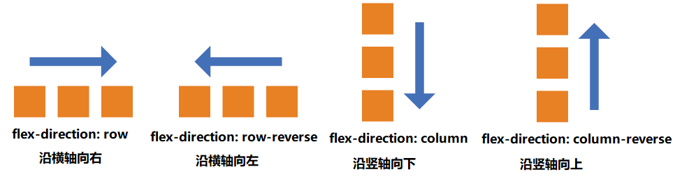

# 相关概念

## 一、示意图


## 二、主要概念

### 1、主轴(Main Axis)

flex-direction 可以设置主轴以及元素排列方向，它有以下四个取值：

```css
flex-direction: row || row-reverse || column || column-reverse;
```

**如图：**



### 2、交叉轴(Cross Axis)

垂直于主轴的轴线是交叉轴。

### 3、起始线和终止线

- 主轴的开始位置（与边框的交叉点）叫做 **`main start`** ，结束位置叫做 **`main end`** ；

- 交叉轴的开始位置叫做 **`cross start`** ，结束位置叫做 **`cross end`** 。

- 如果是**阿拉伯语**，他的书写方式是按照从右向左的方式来写的，这时候起始线和终止线会交换，通过 **`head`** 标签设置浏览器的语言来通知浏览器。浏览器会自动适配的。

### 4、容器和项目

- 采用 Flex 布局的元素，称为 Flex 容器（flex container），简称"**容器**"。

- 容器的所有子元素自动成为容器成员，称为 Flex 项目（flex item），简称"**项目**"或者“**元素**”。设置了 flex 属性后，会让项目的 float，clear，vertical-align 属性失效，不会导致脱离文档流。

### 5、flex 和 inline-flex 的区别

- flex 相当于是块级元素，相当于 div 独占一行
- inline-flex 相当于内联元素，相当于 span，一行有很多个弹性盒子容器。

### 6、正/负自由空间

- 正向自由空间：指的是所有的弹性元素在主轴上排列后，未能占满弹性容器，这时候多余的空间叫做正向自由空间
- 负向自由空间：指的是所有的弹性元素在主轴上排列后，从父容器中溢出，这时候不足的空间叫做负向自由空间
