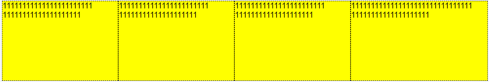
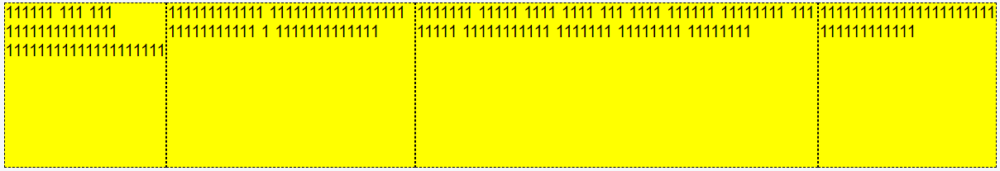
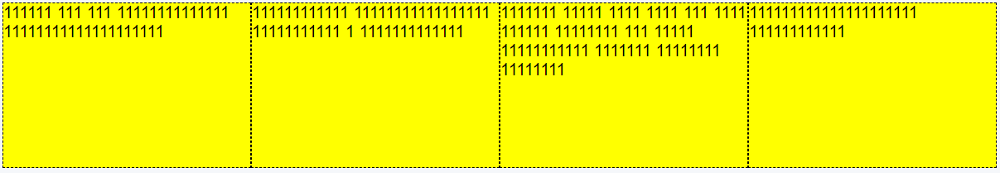
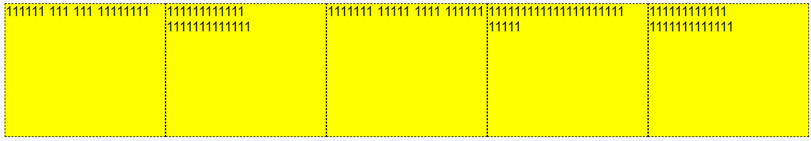
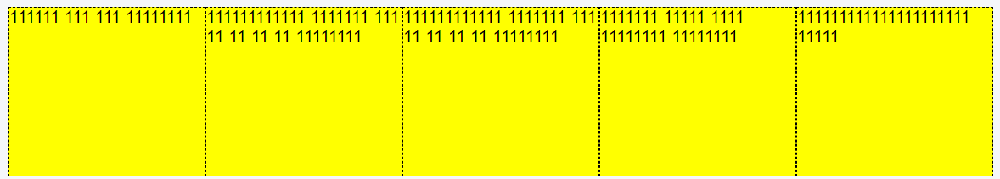
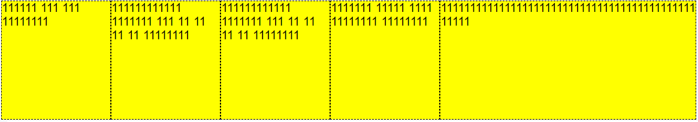
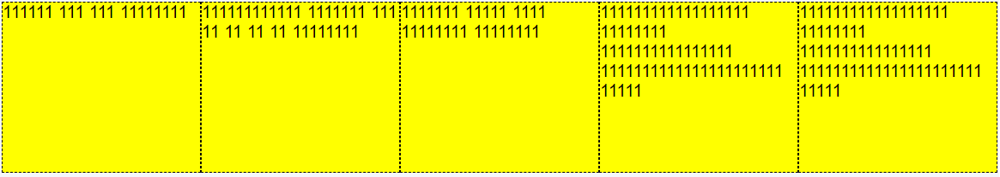
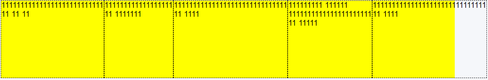
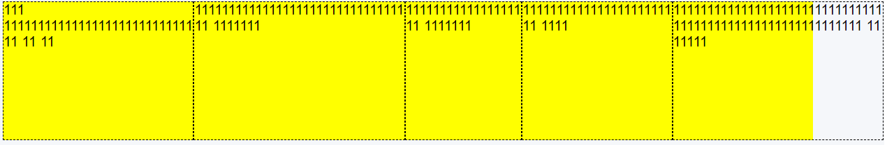

# 1、max-content/min-content

## 一、什么是 min-content

```css
.div1 {
  width: 180px;
}
.div2 {
  width: min-content;
}
```

<div class="flex">
  <div>div1</div>
  <div>div2</div>
</div>
<br/>
<div class="flex">
  <div class="div1">adadadasdad daadada dadadasds sa asda sdasd </div>
  <div class="div2">adadadasdad daadada dadadasds sa asda sdasd </div>
</div>

## 二、什么是 max-content

```css
width: max-content;
```

<div class="div3">adsdad daasddasdadada sa asda sdasd </div>

## 三、如何影响的

### 1、仅设置 display: flex

不存在 width 和 flex-basis 的时候，元素的宽度应该是受 max-content 影响的



某个元素设置了 width 和 flex-basis 的时候，剩余元素的宽度受 max-content 影响的



### 2、设置 display: flex 和 flex: 1



- 假设容器的宽度为 1000px，且在设置成 flex 属性前：

  有多个元素（假设是 5 个）均设置的了 flex：1，那么一般情况他们的伸缩比例是相同的，且强制设置其在主轴上的空间为 0。

  1. 这几个元素在主轴的上的宽度均小于平均宽度（200px）。那么分配剩余空间后，这几个元素的宽度（200px）相等

     

  2. 这几个元素有大于平均宽度（200px）的，有小于平均宽度（200px）的，但是加起来不大于 1000px，此时存在：

     - 当所有的元素 min-content 小于等于平均宽度（200px）的时候，宽度平分，最终每一个元素都是平均宽度（200px）；

       

     - 当有元素 min-content 大于平均宽度（200px）的时候，那么它的宽度最终为 min-content，然后剩余的宽度有另外的元素平分。

       

  3. 当这几个元素有大于平均宽度（200px），有小于平均宽度（200px）的，加起来大于 1000px，此时存在：

     - 当这几个元素的 min-content 均未大于平均宽度（200px），那么这几个元素平分后最终均为平均宽度（200px）；

       

     - 当有的 min-content 大于平均宽度（200px），有的小于平均宽度（200px），总的加起来并未超过 1000px，那么 1000px 减去大于平均宽度（200px）的 min-content，剩下的元素平分后，宽度相等，大于平均宽度（200px）的元素宽度均为其各自的 min-content。如果这时候最终总宽度大于 1000px，会溢出。

       

     - 如果所有的元素的 min-content 均大于平均宽度（200px），那么最终宽度为各自的 min-content，溢出。

       

<style scoped>
.div1 {
  width: 160px;
  height: 100px;
  background: yellow;
  border: dashed 1px;
}
.div2 {
  width: min-content;
  height: 100px;
  background: yellow;
  border: dashed 1px;
}
.div3 {
  width: max-content;
  height: 100px;
  background: yellow;
  margin: 20px;
  border: dashed 1px;
}
.flex {
  display: flex;
  justify-content: space-evenly;
}
.container {
  width: 100%;
  height: 100px;
  background: yellow;
}
.item {
  border: dashed 1px;
 }
 .item1 {
  border: dashed 1px;
  flex: 1;
 }
.css-container {
  display: flex;
}
.css-item {
  display: inline-block;
  flex: 1;
  margin: 5px;
}
</style>
