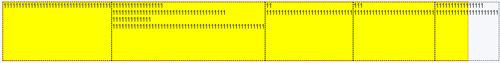
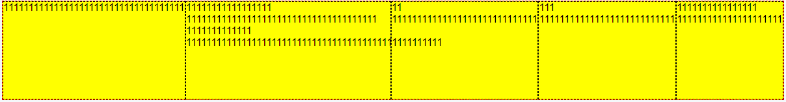

# 5、min-width

- 在一个flex布局中，对于一个设置了flex属性设置为1的div容器，再对其设置min-width：0，保证元素不溢出外层容器

```html
<div class="container">
  <div class="item">11111111111111111111111111111</div>
  <div class="item">11111111111111111 11111111111111111111111111111111111111 1111111111111 111111111111111111111111111111111111111111111111111</div>
  <div class="item">11 11111111111111111111111111111</div>
  <div class="item">111 111111111111111111111111111</div>
  <div class="item">1111111111111111 111111111111111111111</div>
</div>
```



- 给第二个元素添加min-width: 0


