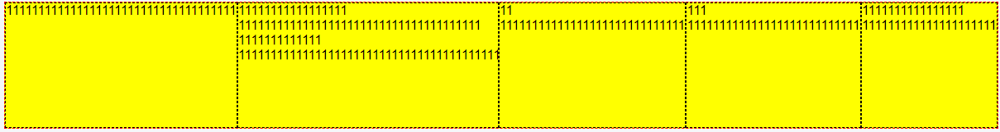

# 6、overflow

给第二个元素添加 overflow: hidden,效果类似 min-width，但是多余的部分被遮挡了

```html
<div class="container">
  <div class="item">11111111111111111111111111111</div>
  <div class="item">
    11111111111111111 11111111111111111111111111111111111111 1111111111111
    111111111111111111111111111111111111111111111111111
  </div>
  <div class="item">11 11111111111111111111111111111</div>
  <div class="item">111 111111111111111111111111111</div>
  <div class="item">1111111111111111 111111111111111111111</div>
</div>
```


