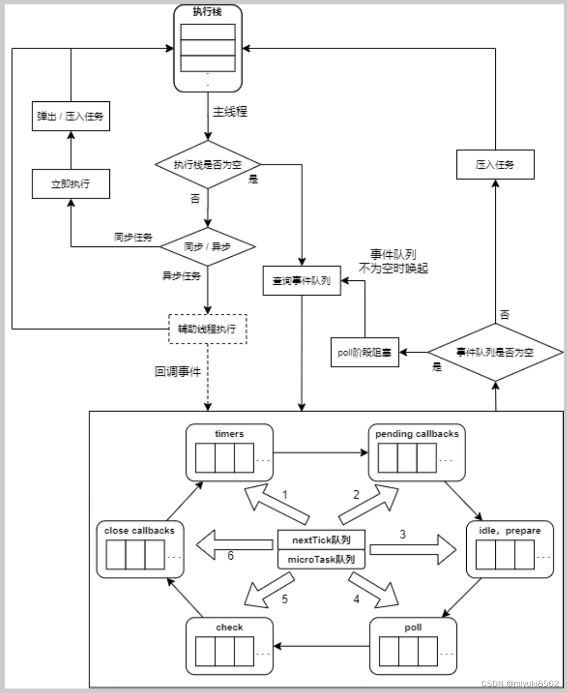

# 20、详细的描述一下事件循环

Node.js 的事件循环（Event Loop）是其异步非阻塞 I/O 模型的核心，基于 **libuv** 库实现。它通过多阶段的任务调度机制，高效管理定时器、I/O 操作、网络请求等异步任务。以下是事件循环的详细运转流程：

## 1. 事件循环的六个阶段

事件循环按顺序执行六个阶段，每个阶段处理特定类型的任务队列，并在每个阶段完成后执行微任务（如 `process.nextTick` 和 `Promise`）。

### 阶段 1：Timers（定时器阶段）

- **任务类型**：处理 `setTimeout` 和 `setInterval` 的回调。
- **执行逻辑**：
  - 检查定时器堆（Timer Heap）中是否有到期的定时器。
  - 执行所有到期的定时器回调。
  - **注意**：定时器的实际执行时间可能比设定的延迟更长（受事件循环状态影响）。
- **示例**：
  ```javascript
  setTimeout(() => console.log("Timeout"), 100);
  // 若事件循环其他阶段耗时超过 100ms，回调可能延迟执行。
  ```

### 阶段 2：Pending I/O Callbacks（挂起的 I/O 回调）

- **任务类型**：处理系统操作（如 TCP 错误、文件读写错误）的回调。
- **执行逻辑**：
  - 执行上一轮事件循环中未处理的 I/O 回调。
  - 例如，如果 TCP 连接尝试失败，其错误回调会在此阶段执行。
- **示例**：
  ```javascript
  const net = require("net");
  const socket = net.connect("invalid_port");
  socket.on("error", (err) => console.log("Error here!"));
  // 'error' 回调在此阶段执行。
  ```

### 阶段 3：Idle/Prepare（闲置/准备阶段）

- **任务类型**：Node.js 内部使用的阶段，开发者通常无需关注。
- **作用**：为后续阶段准备资源或执行内部任务。

### **阶段 4：**Poll**（轮询阶段）**

- **核心阶段**：处理 I/O 事件（如文件读写、网络请求）的回调。
- **执行逻辑**：
  1. **处理 Poll 队列中的回调**：
     - 执行所有已完成的 I/O 操作的回调（例如 `fs.readFile` 的回调）。
     - 队列为空时，检查是否有 `setImmediate` 任务：
       - 如果有，进入 **Check 阶段**。
       - 如果没有，检查是否有到期的定时器（Timers 阶段）。
  2. **计算阻塞时间**：
     - 如果队列为空且无 `setImmediate`，事件循环会阻塞等待新的 I/O 事件。
     - 阻塞的最长时间由最近的定时器到期时间决定。
- **示例**：
  ```javascript
  fs.readFile("file.txt", () => {
    console.log("I/O 完成，回调在 Poll 阶段执行");
  });
  ```

### 阶段 5：Check（检查阶段）

- **任务类型**：执行 `setImmediate` 的回调。
- **执行逻辑**：
  - 清空 `setImmediate` 队列中的所有回调。
  - **优先级**：在 I/O 回调中，`setImmediate` 总是先于 `setTimeout(fn, 0)`。
- **示例**：
  ```javascript
  setImmediate(() => console.log("Immediate 回调"));
  ```

### 阶段 6：Close Callbacks（关闭回调阶段）

- **任务类型**：处理关闭事件的回调（如 `socket.on('close')`）。
- **示例**：
  ```javascript
  const server = net.createServer();
  server.on("close", () => console.log("Server closed!"));
  server.close(); // 'close' 回调在此阶段执行。
  ```

## 2. 微任务（Microtasks）的执行时机

微任务在 **每个阶段结束后立即执行**，优先级高于下一阶段的宏任务。

### 微任务类型：

1. **`process.nextTick` 回调**：优先级最高。
2. **`Promise` 回调**：优先级次于 `process.nextTick`。

### 执行规则：

- 每个阶段完成后，先清空 `process.nextTick` 队列，再清空 `Promise` 队列。
- 微任务执行期间新添加的微任务会被一并处理（可能导致饿死事件循环）。

### 示例：

```javascript
setImmediate(() => {
  console.log("Check 阶段");
  process.nextTick(() => console.log("nextTick 在 Check 阶段后"));
});

// 输出顺序：
// Check 阶段 → nextTick 在 Check 阶段后
```

## 3. 事件循环的完整运转流程

1. **启动事件循环**：执行同步代码，初始化定时器、I/O 操作等。
2. **进入循环**：
   - **Timers 阶段** → 处理到期的定时器。
   - **Pending I/O Callbacks** → 处理系统级回调。
   - **Idle/Prepare** → 内部任务。
   - **Poll 阶段** → 处理 I/O 回调，可能阻塞等待新事件。
   - **Check 阶段** → 处理 `setImmediate`。
   - **Close Callbacks** → 处理关闭事件。
3. **循环条件**：如果仍有活跃的句柄（如定时器、TCP 连接），继续循环；否则退出。

## 4. 关键 API 的归属阶段

| API                  | 所属阶段/类型   | 说明                                                             |
| -------------------- | --------------- | ---------------------------------------------------------------- |
| `setTimeout`         | Timers 阶段     | 回调在 Timers 阶段执行，实际时间受事件循环状态影响。             |
| `setImmediate`       | Check 阶段      | 在 Check 阶段执行，优先级在 I/O 回调中高于 `setTimeout(fn, 0)`。 |
| `fs.readFile`        | Poll 阶段       | I/O 完成后的回调在 Poll 阶段执行。                               |
| `process.nextTick`   | 微任务队列      | 当前阶段结束后立即执行，优先级最高。                             |
| `Promise.then()`     | 微任务队列      | 当前阶段结束后执行，优先级次于 `process.nextTick`。              |
| `server.on('close')` | Close Callbacks | 关闭事件回调在此阶段执行。                                       |

## 5. 执行顺序示例与解析

### 示例 1：顶层代码中的 `setTimeout` vs `setImmediate`

```javascript
setTimeout(() => console.log("Timeout"), 0);
setImmediate(() => console.log("Immediate"));

// 输出顺序可能随机：
// 可能是 Timeout → Immediate，也可能是 Immediate → Timeout
```

**原因**：  
事件循环启动时，若准备时间超过 1ms，Timers 阶段的 `setTimeout` 已到期，先执行；否则进入 Check 阶段先执行 `setImmediate`。

### 示例 2：I/O 回调中的确定顺序

```javascript
const fs = require("fs");
fs.readFile("file.txt", () => {
  setTimeout(() => console.log("Timeout"), 0);
  setImmediate(() => console.log("Immediate"));
});

// 输出顺序始终为：Immediate → Timeout
```

**原因**：  
I/O 回调在 Poll 阶段执行，之后会直接进入 Check 阶段处理 `setImmediate`，下一轮循环再处理 Timers 阶段的 `setTimeout`。

## 6. 浏览器与 Node.js 事件循环的区别

| **特性**           | **浏览器事件循环**                              | **Node.js 事件循环**              |
| ------------------ | ----------------------------------------------- | --------------------------------- |
| **阶段划分**       | 无明确阶段，分宏任务（如 `setTimeout`）和微任务 | 六个明确阶段                      |
| **微任务执行时机** | 每个宏任务后执行                                | 每个阶段结束后执行                |
| `setImmediate`     | 不支持                                          | 在 Check 阶段执行                 |
| `process.nextTick` | 不支持                                          | 微任务，优先级最高                |
| **渲染时机**       | 在宏任务之间可能触发渲染                        | 无渲染概念，专注于 I/O 和异步任务 |

## 7. 如何避免事件循环阻塞？

1. **分解 CPU 密集型任务**：使用 `setImmediate` 或 `process.nextTick` 分段处理。
   ```javascript
   function heavyTask() {
     // 分段处理
     if (hasMoreWork) {
       setImmediate(heavyTask);
     }
   }
   ```
2. **优先使用异步 API**：如 `fs.readFile` 而非 `fs.readFileSync`。
3. **监控事件循环延迟**：使用工具（如 `loopbench`）检测阻塞。

## 8. 总结

- **事件循环顺序**：Timers → Pending I/O → Poll → Check → Close，循环执行。
- **微任务优先级**：`process.nextTick` > `Promise`，在每个阶段结束后立即执行。
- **设计目标**：通过非阻塞 I/O 和高效的任务调度，支持高并发场景。
- **实践要点**：理解阶段归属、避免阻塞 Poll 阶段、利用微任务优化代码。

掌握事件循环的机制，可以更精准地控制异步代码的执行顺序，优化性能并避免潜在问题（如回调饥饿或意外阻塞）。


