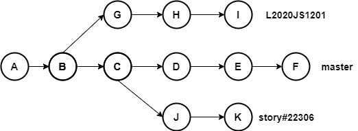
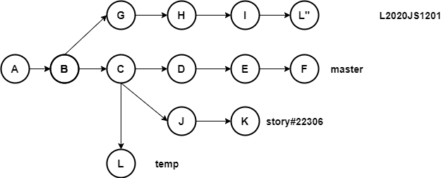
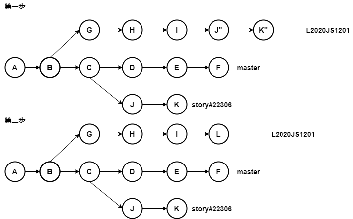

# 通过分支管理需求，代码的最佳实践

假设有以下代码：



- `master`分支是主分支，演进路线，代码都往主干分支合并
- `L2020JS1201`分支，是版本分支，即拉出转测，准备2020年12月1号发布版本
- `story#22306`分支，是我们做过的某一个需求，该需求已合并master分支，

**现在需求来了，`22306`这个需求要提前一个版本上线，在`L2020JS1201`版本里发布。**

我们分析一下场景:

- `story#22306`分支发育的晚于`L2020JS1201`分支
- 尽量操作简单、便捷
- 一旦出现问题，方便回退
- 不要出现多余的代码引入

::: warning 说明
如果是`story#22306`分支早于`L2020JS1201`分支，那么问题就很简单，我们直接将`story#22306`分支压缩合并过去即可

```bash
git merge story#22306 --squash
```

:::

## 三种手段可以用：

- **`merge`** 合并分支

- **`rebase`** 合并分支

- **`cherry-pick`** 遴选代码合并过去

**存在的问题**

- merge和rebase直接进行分支合并，都会先寻找一个公共祖先，直接合并分支可能会带来多余的代码。  
  我们查看提交历史发现，提交`C`是多余的，我们不想合入。

- 使用`cherry-pick`是个不错的选择，可以直接操作一段commit，将`story#22306`分支的提交直接遴选过去,同样问题也很明显，一旦发生问题，需要回退好几个提交的代码

## 三种方案可利用特性：

- **`merge --squash`** 可以将一个分支压缩合并成一个提交到另外一个分支
- **`cherry-pick`** 可以遴选一段提交
- **`rebase -i`** 交互式变基，可以对提交进行增删改、合并。

## 最终两种推荐方案：

### 1. 创建临时分支，将`story#22306`分支整体压缩成一个提交，然后将该临时分支遴选到`L2020JS1201`分支

操作示意图：



#### 详细操作

- 首先基于提交`C`创建`temp`临时分支
  
  ```bash
  git branch temp C
  ```

- 切换到该分支
  
  ```bash
  git checkout temp
  ```

- 将`story#22306`分支压缩合并到该分支，生成一个新的提交`L`  
  
  ```bash
  git merge story#22306 --squash 
  ```
  
  ::: warning 说明
  为防止部分终端可能存在语法问题，可以将`story#22306`使用引号括起来，标识这是一个完整参数
  :::

- 切换到`L2020JS1201`分支，将压缩合并产生的新提交`L`遴选过来，就算完成了。
  
  ```bash
  git checkout L2020JS1201
  git cherry-pick L 
  ```

### 2. 将`story#22306`分支上的提交遴选到`L2020JS1201`分支，然后将这部分提交利用交互式变基压缩成一个提交

操作示意图：


- 首先使用`cherry-pick`将代码遴选到`L2020JS1201`分支
  
  ```bash
  git checkout L2020JS1201
  git cheerry-pick J..K
  ```

- 使用交互式变基将代码压缩成一个新的提交`L`，因为`J..K`共两个提交，所以参数为2。
  
  ```bash
  git rebase -i HEAD~2
  ```

::: warning 举一反三
某条分支上最新的一段提交压缩成为一个提交，使用reset也可以达到同样的效果

```bash
git reset --soft I
git commit -m "message"
```

:::
