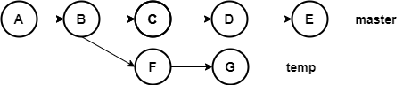
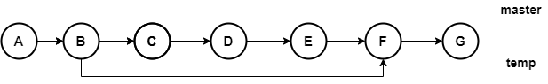
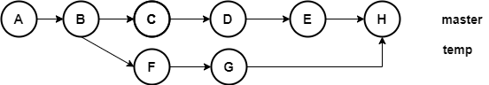
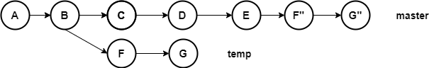

# merge、rebase、cherry-pick的区别

现在有以下代码，我们需要将`temp`分支合并到`master`分支：

## 详细介绍

### merge操作

- 没遇到冲突，结果类似于快进

- 以生成一个新的合并提交的形式结束，一般遇到冲突会这样

### rebase操作

### cherry-pick操作

## 三者的异同点

- merge和rebase都是操作单位是分支（branch），cherry-pick操作单位是提交（commit）

- 三者都是一个提交一个提交的往目标分支上合，而merge会将全部冲突留到最后一起处理，而rebase和cherry-pick会停下来，等处理完当前冲突，再继续

- merge不会修改历史，rebase和cherry-pick会修改历史，如果没有遇到冲突，仅仅修改commit-id，如果遇到冲突，冲突处理结果和该提交一并合并成为一个新提交

- merge遇到冲突，处理结果包含在生成的合并提交里，而cherry-pick和rebase则包含在冲突提交中。
