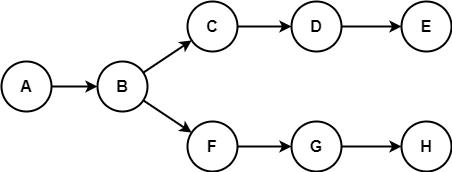

# 常用的操作符

## 全选操作符 **.**

### 作用

一般是全选的意思，当前目录下变动的文件列表

### 举例

```bash
## 将全部修改添加到暂存区
git add .
## 将暂存区的全部修改还原回工作区
git reset .
```

## 引用操作符 **/**

### 作用

引用的意思，一般用在引用某个库的某个分支

### 举例

```bash
## 重置工作区代码和某个远端分支保持一致
git reset --hard origin/master
```

## 目标操作符 **:**

### 作用

描述远端和本地的一个对应目标关系。

**`source`:`target`**，左边是本地来源，右边是远端目标

### 举例

- 推送本地分支代码到远端
  
  ```bash
  git push origin master:master
  ```

- 推动标签到远端
  
  ```bash
  git push origin refs/tags/源标签名:refs/tags/目的标签名
  ```
  
  ::: warning 举一反三
  如果左边来源没传，则等同于删除右侧的远端目标，例如：
  
  ```bash
  ## 删除远端的DTS分支
  git push origin :DTS
  ## 删除远端v1.1.1标签
  git push origin :refs/tags/v1.1.1
  ```
  
  :::

## 祖先操作符 **~**/**^**

### 作用

用来获取某次提交或者某个指针指向的提交的某个祖先

### 举例

```bash
## 重置工作区为当前提交的父提交
git reset head~1
git reset head^1
git reset head^
git reset ^head
```

## 堆栈次序 **@{index}**

### 作用

一般是栈结构的才会用到，比如stash，reflog

### 举例

```bash
## 取出但不删除某个暂存备份
git stash apply stash@{1}
```

## 区间操作符 **..**/**...**

### 作用

两个提交之间的区间

### 举例

```bash
## 遴选某一段提交到当前分支
git cherry-pick f5a199a0..2b44e5df
git cherry-pick f5a199a0...2b44e5df
## 导出某一段变更记录
git diff f5a199a0..2b44e5df --output=diff.diff
```

### 二者的区别

以此图为例子：



`E..H`的结果：`E`>`F`>`G`>`H`

`E...H`的结果：`B`>`C`>`D`>`E`>`F`>`G`>`H`

`H..E`的结果：`H`>`C`>`D`>`E`

`H...E`的结果：`B`>`F`>`G`>`H`>`C`>`D`>`E`
